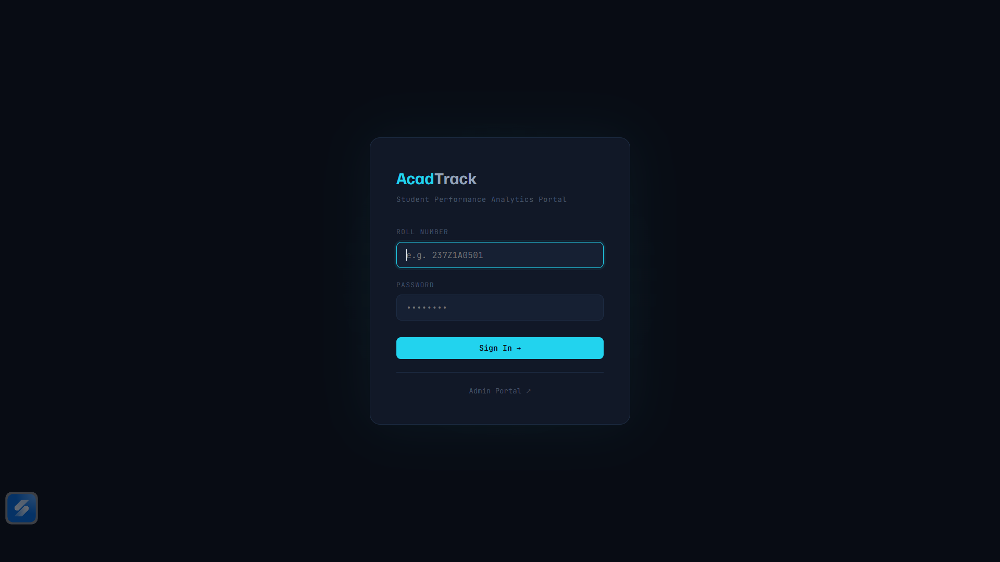
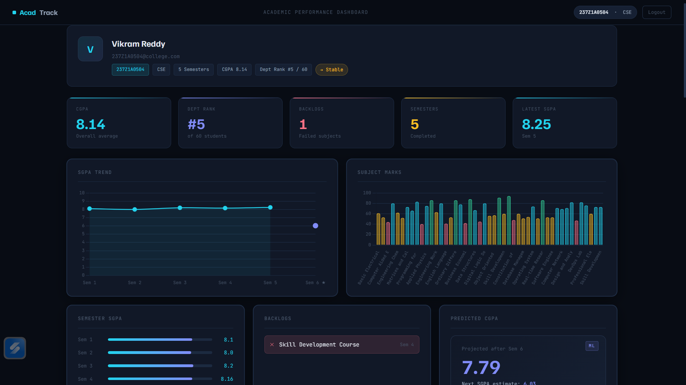
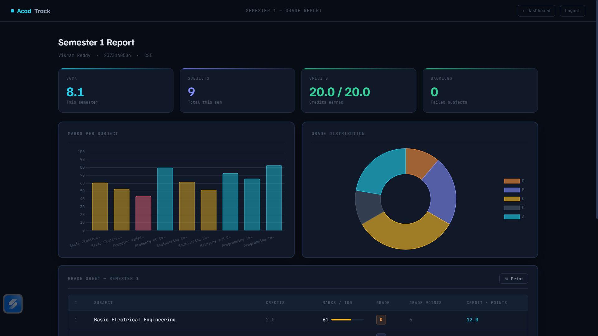
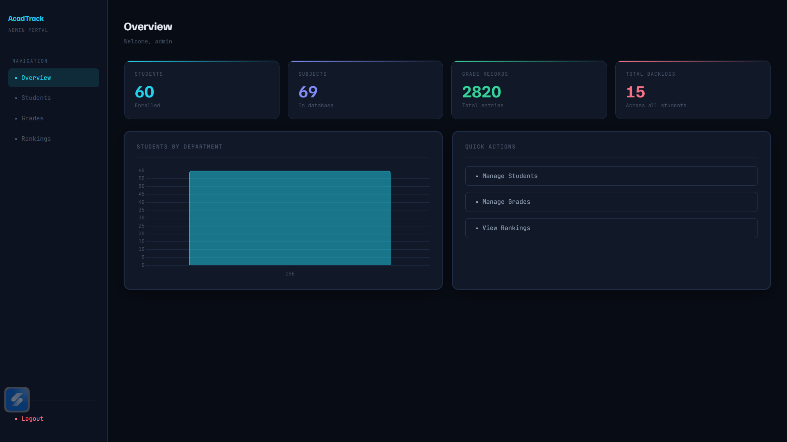

# 🎓 AcadTrack – Student Performance Analytics Platform


> A web-based academic performance dashboard for BTech universities, built with Python Flask and MySQL.
> Students can log in to view their grades, SGPA/CGPA, backlogs, department rank, and a machine learning–powered CGPA prediction — all in one place.
> Supports multiple branches with shared and branch-specific subject mappings.

---

## 📸 Preview

| Login Page | Dashboard |
|---|---|
|  |  |

| Semester Report | Admin Panel |
|---|---|
|  |  |

---

## ✨ Features

### Student Portal

* 🔐 **Secure Login** — Roll number + password authentication
* 📊 **Live Dashboard** — CGPA, SGPA trend, department rank, subject-wise marks
* 📋 **Semester Reports** — Detailed grade sheet with marks bar, grade distribution chart, printable
* ⚠️ **Backlog Detection** — Automatically detects failed subjects (grade = F) and highlights them
* 🏆 **Department Ranking** — Shows student's rank within their own branch
* 🤖 **ML CGPA Prediction** — Linear Regression model predicts future SGPA from history
* 📈 **Performance Trend** — Improving / Declining / Stable badge based on recent SGPA

---

### Admin Portal

* 🔑 **Separate Admin Login** — Independent admin authentication
* 🗂️ **Manage Students** — Add, view, delete with branch tab filter + live search + colour-coded badges
* 👁️ **Student Profile View** — Admin can view any student's full dashboard (read-only)
* 📝 **Manage Grades** — Add, view, delete with branch filter, semester filter, grade filter
* 🥇 **Department Rankings** — Full rank table per branch with global search + branch filter + print support
* 📊 **System Overview** — Students by branch, backlogs by branch, branch summary table with rates
* 🔔 **Toast Notifications** — Styled confirm dialogs and slide-in toasts replace browser popups
* 🍞 **Breadcrumbs** — Context-aware breadcrumbs on every admin page

---

## 🏫 Supported Branches

| Branch | Roll Number Format | Subjects |
|---|---|---|
| CSE — Computer Science & Engineering | `237Z1A05xx` | 65 mapped subjects |
| IT — Information Technology | `237Z1A04xx` | 65 mapped subjects |
| CSM — CS with AI/ML | `237Z1A66xx` | 68 mapped subjects |
| CSD — CS with Data Science | `237Z1A76xx` | 67 mapped subjects |

Subjects shared across branches (e.g. Matrices & Calculus, Data Structures) exist **once** in the database and are mapped via the `Branch_Subjects` junction table.

---

## 🗂️ Project Structure

```
acadtrack_v2/
├── app.py                        # Main Flask app — all routes
├── db.py                         # MySQL connection helper
├── train_model.py                # ML training script (run once)
├── requirements.txt              # Python dependencies
├── setup_upgrade.sql             # DB setup script (Admins, Predictions, indexes)
├── university_dataset.sql        # Multi-branch dataset (Branch_Subjects + students + grades)
│
├── ml/
│   ├── predictor.py              # Linear Regression prediction logic
│   └── cgpa_model.pkl            # Trained model file (generated by train_model.py)
│
├── static/
│   └── css/
│       └── style.css             # Dark theme stylesheet
│
├── templates/
│   ├── login.html
│   ├── dashboard.html
│   ├── semester_report.html
│   └── admin/
│       ├── _base.html            # Shared sidebar macro
│       ├── _toast.html           # Toast + confirm dialog
│       ├── admin_login.html
│       ├── admin_panel.html
│       ├── manage_students.html
│       ├── manage_grades.html
│       ├── rankings.html
│       └── student_profile.html  # Admin read-only student view
│
└── screenshots/
    ├── login.png
    ├── dashboard.png
    ├── semester.png
    └── admin.png
```

---

## 🛠️ Tech Stack

| Layer | Technology |
|---|---|
| Backend | Python 3.x, Flask |
| Database | MySQL 8.x |
| Machine Learning | scikit-learn, numpy, joblib |
| Frontend | HTML, Jinja2, CSS |
| Charts | Chart.js |
| Fonts | Familjen Grotesk, JetBrains Mono |

---

## 🗄️ Database Schema

```
Students         — student_id (PK), name, email, password, department
Subjects         — subject_id (PK), subject_name, credits, semester
Branch_Subjects  — id (PK), subject_id (FK), department, semester  ← junction table
Semesters        — semester_id (PK), semester_number
Grades           — grade_id (PK), student_id (FK), subject_id (FK), semester_id (FK), marks, grade
GradePoints      — grade (PK), points
Admins           — admin_id (PK), username, password
Predictions      — prediction_id (PK), student_id (FK), predicted_sgpa, predicted_cgpa, next_semester, confidence
```

### Why Branch_Subjects?

Many subjects are shared across branches (e.g. Data Structures is common to CSE, IT, CSM, CSD).
Instead of duplicating subject rows, `Branch_Subjects` maps each subject to its branches and semester — a clean many-to-many relationship.

---

## 📊 Grade Points

| Grade | Marks | Points |
|---|---|---|
| O | 90–100 | 10 |
| A | 80–89 | 9 |
| B | 70–79 | 8 |
| C | 60–69 | 7 |
| D | 50–59 | 6 |
| F | 0–49 | 0 |

---

## ⚙️ SGPA / CGPA Calculation

```
SGPA = Σ(Grade Points × Credits) / Σ(Credits)        [Per semester]
CGPA = Σ(Grade Points × Credits) / Σ(Credits)        [All semesters]
```

> Failed subjects (`F`) and zero-credit subjects are **excluded** from all GPA calculations.
> Only subjects mapped to the student's branch via `Branch_Subjects` are included.

---

## 🚀 Installation & Setup

### Prerequisites

* Python 3.9+
* MySQL 8.x
* pip

---

### Step 1 — Install Dependencies

```bash
pip install -r requirements.txt
```

If scikit-learn fails:

```bash
pip install scikit-learn numpy joblib --upgrade
```

---

### Step 2 — Configure Database

Edit `db.py`:

```python
DB_CONFIG = {
    'host':     'localhost',
    'user':     'root',
    'password': 'yourpassword',
    'database': 'student_grade_system'
}
```

---

### Step 3 — Run Setup Script

```bash
source setup_upgrade.sql
```

Creates: Admins table, Predictions table, performance indexes.

---

### Step 4 — Load Multi-Branch Dataset

```bash
source university_dataset.sql
```

This runs in 5 steps automatically:
1. Creates `Branch_Subjects` junction table
2. Inserts all subjects (121 unique course codes)
3. Populates branch-subject mappings (275 rows across 4 branches)
4. Inserts 180 new students (IT + CSM + CSD)
5. Inserts 6,720 grade records

---

### Step 5 — Train ML Model

```bash
python train_model.py
```

Trains on all 240 students across all branches. Output:

```
Found X students with 2+ semesters of data.
Model saved to ml/cgpa_model.pkl
```

---

### Step 6 — Run Application

```bash
python app.py
```

Server starts at: `http://127.0.0.1:5000`

---

## 🔐 Default Credentials

### Student Login

| Branch | Example Roll No | Password |
|---|---|---|
| CSE | `237Z1A0501` | `237Z1A0501` |
| IT | `237Z1A0401` | `237Z1A0401` |
| CSM | `237Z1A6601` | `237Z1A6601` |
| CSD | `237Z1A7601` | `237Z1A7601` |

### Admin Login

```
URL      : http://127.0.0.1:5000/admin/login
Username : admin
Password : admin123
```

> ⚠️ For production: change admin password, implement bcrypt hashing, enable HTTPS.

---

## 📡 Application Routes

### Student Routes

| Route | Method | Description |
|---|---|---|
| `/` | GET | Redirect to login |
| `/login` | GET/POST | Student login |
| `/logout` | GET | Logout |
| `/dashboard` | GET | Student dashboard |
| `/semester/<n>` | GET | Semester report |

### Admin Routes

| Route | Method | Description |
|---|---|---|
| `/admin/login` | GET/POST | Admin login |
| `/admin` | GET | Overview dashboard |
| `/admin/students` | GET | Student management |
| `/admin/student/<sid>` | GET | Student profile (read-only) |
| `/admin/grades` | GET | Grade management |
| `/admin/rankings` | GET | Department rankings |

---

## 🤖 Machine Learning Module

**Model:** Linear Regression (scikit-learn)

**Inputs:** Semester number, previous SGPA values
**Outputs:** Predicted SGPA, confidence level (high / medium), trend direction

```
ml/
├── predictor.py       # train_model(), predict_next_sgpa(), get_trend()
└── cgpa_model.pkl     # Saved model (generated after running train_model.py)
```

> Prediction is only shown when a student has **2+ semesters** of data.
> Confidence is `high` for 3+ semesters, `medium` for exactly 2.

---

## 📊 Dataset Summary

| Item | Count |
|---|---|
| Total students | 240 (60 per branch) |
| Branches | 4 (CSE, IT, CSM, CSD) |
| Unique subjects | 121 |
| Branch-subject mappings | 275 |
| Semesters with data | 4 (Sem 1–4) |
| Total grade records | 9,540 |

### Student Profiles (realistic distribution)

| Profile | Students | Behaviour |
|---|---|---|
| 🌟 Toppers | 9 per branch | Mostly O/A, improving trend |
| 📈 Above Average | 15 per branch | Mostly A/B |
| 📊 Average | 21 per branch | Mix of B/C/D |
| 📉 Struggling | 11 per branch | C/D heavy, some F |
| ⚠️ At Risk | 4 per branch | Multiple F grades, backlogs |

---

## 🔮 Future Enhancements

* Password hashing (bcrypt)
* Email notifications for backlogs
* Mobile responsive UI
* Export reports as PDF
* Advanced ML models (LSTM for sequence prediction)
* WebSocket-based real-time updates
* ECE branch support

---

## 📦 Dependencies

```
Flask==3.0.0
mysql-connector-python==8.2.0
scikit-learn>=1.4.0
numpy>=1.26.0
joblib>=1.4.2
Werkzeug==3.0.1
```

External (CDN):
* Chart.js
* Google Fonts (Familjen Grotesk, JetBrains Mono)

---

## 👨‍💻 Author

Built as a **BTech mini project — Student Academic Performance Analytics System**
NNRG — Nalla Narasimha Reddy Group of Institutions

---

## 📄 License

This project is intended for **educational purposes only**.
